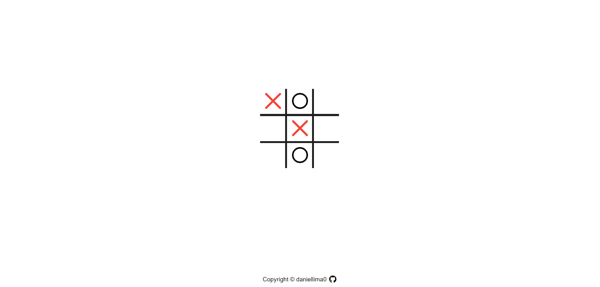

# tic-tac-toe-browser

## Introduction
This project was built with plain HTML, CSS and Javascript and it is part of [The Odin Project's curriculum](https://www.theodinproject.com/).

## Screenshot

## Live Demo
This project is hosted on my GitHub Pages and you can access it [in here](https://daniellima0.github.io/tic-tac-toe-javascript/).